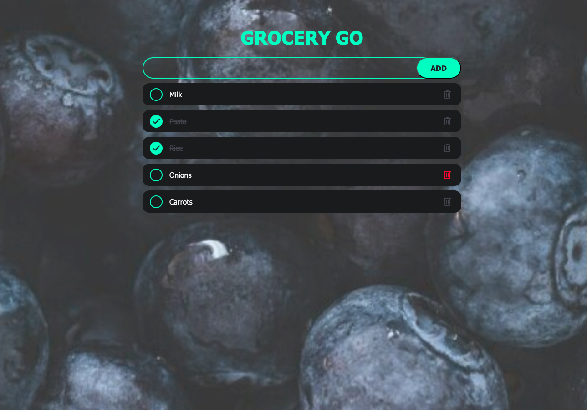

# GroceryGo

Responsive Shopping List Web Application

<!--  -->

## Features:

- Add, edit, and delete items on your shopping list
- Persistent storage using localStorage
- Responsive design for seamless use on various screen sizes
- Modern UI with custom themes and accents
- Opaque image background for aesthetic appeal

## Installation:

To run this project locally, follow these steps:

- Clone the repository:

git clone https://github.com/your-username/shopping-list-app.git
cd shopping-list-app

- Open the project:
  Open the index.html file in your preferred web browser.

## Deployment and Website name:

- You can use the App or Web clicking bellow:
  [grocerygo.store](https://www.grocerygo.store/)
- It's been deplyed using Hostinger.

## Usage

- Add an Item:

Type the name of the item in the input field.
Click the "Add" button or press "Enter" to add the item to your list.

- Mark an Item as Complete:

Click the checkbox next to an item to mark it as complete.
Completed items will have a strikethrough and a different color.

- Delete an Item:

Click the delete button (trash icon) next to an item to remove it from the list.

## CSS Overview

Please refer to style.css file. The CSS is designed to provide a modern and responsive layout:

- Colors: Customizable variables for background, primary, secondary, accent, and text colors.
- Fonts: Uses "Segoe UI", Tahoma, Geneva, Verdana, and sans-serif for a clean and professional look.
- Layout: Flexbox is used for alignment and spacing, ensuring a responsive design.
  Media Queries: Adjustments for font sizes, padding, and layout for screens smaller than 500px.

## Contributing

Contributions are welcome! Please fork the repository and create a pull request with your changes.
